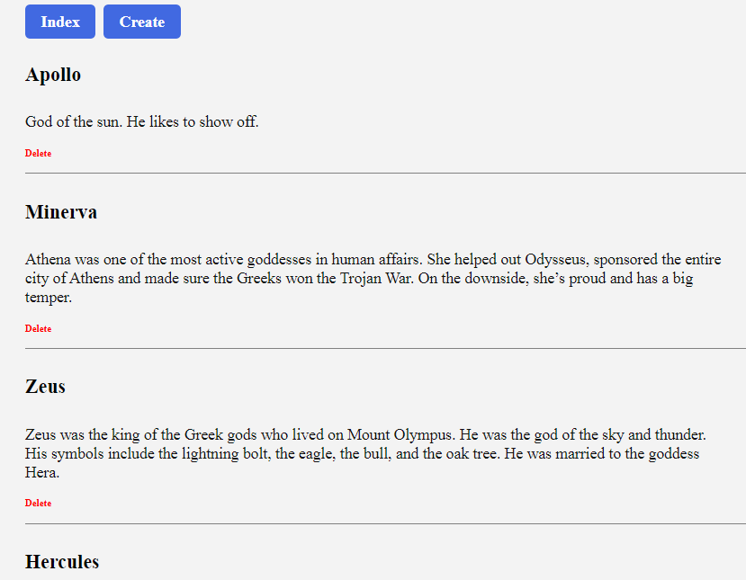
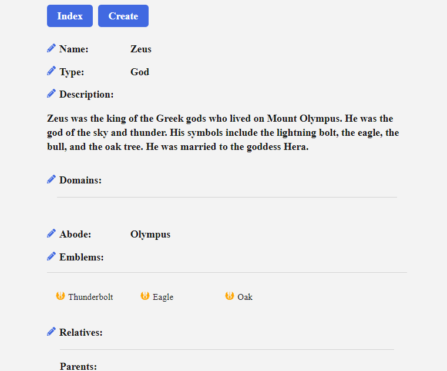
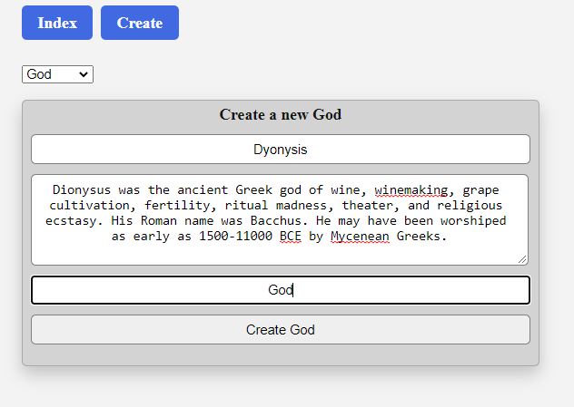

# GraphQLGreekGods

This was a homework assignment in App Academy's GrapghQL course.
The project involved creating the backend models and schema and connecting this to the frontend using Apollo and React.
In this project I was able to practice generating queries and mutations.

